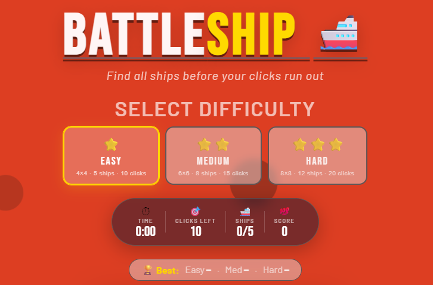
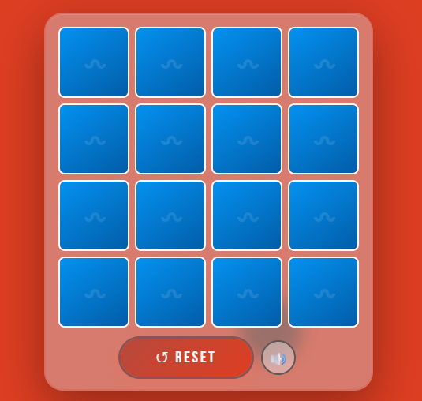
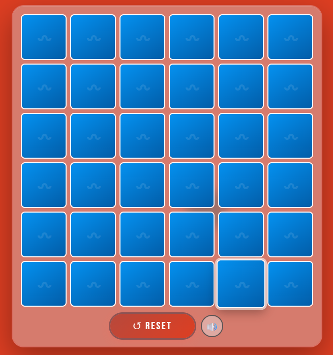
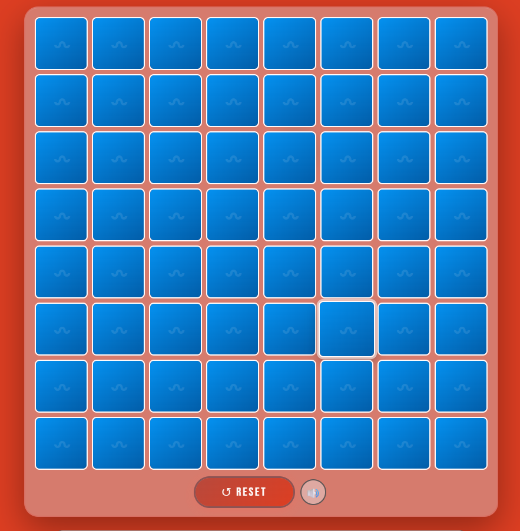
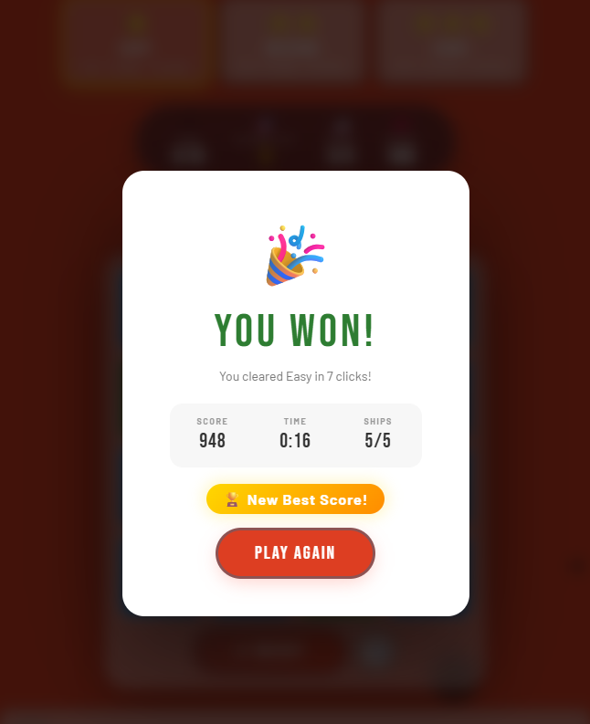
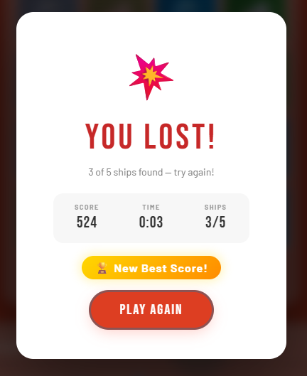
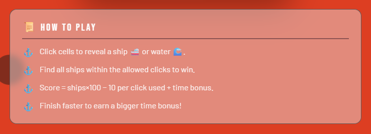

# Battleship Game

A lightweight browser-based Battleship mini-game built with HTML, CSS, and JavaScript.

## Game Overview

This project is a fast, arcade-style version of Battleship playable across three difficulty levels.
You uncover tiles one by one to find all hidden ships before you run out of clicks.

**Difficulty Levels:**
- **Easy**: 4×4 grid (16 cells) · 5 ships · 10 clicks
- **Medium**: 6×6 grid (36 cells) · 8 ships · 15 clicks
- **Hard**: 8×8 grid (64 cells) · 12 ships · 20 clicks

**Scoring System:**
- Base score: 100 points per ship found
- Penalty: −10 points per unnecessary click
- Time bonus: up to +300 points for speed (faster = more bonus)
- Win bonus: +200 points for finding all ships
- Best scores are tracked per difficulty and stored locally

## Features

- **Three difficulty levels** with dynamic grid sizing and adjustable ship counts
- **Random ship placement** for unique gameplay every round
- **Dynamic bubble animations** with 8 unique animated background effects
- **Animated reveal effects** with flip transitions and ripple feedback
- **Live HUD display** showing:
  - Elapsed time (with auto-start timer)
  - Clicks remaining (with color warnings)
  - Ships found / total
  - Live score calculation
- **Best scores tracking** per difficulty level (stored in browser localStorage)
- **Sound effects** with Web Audio API (toggle on/off)
- **Win/Lose result overlay** with final stats and new best score badge
- **Responsive design** for desktop, tablet, and mobile devices

## Rules And Guidelines

1. **Select a difficulty** before starting (Easy, Medium, or Hard).
2. Click any unrevealed grid cell to scan it.
3. Each click reveals either:
   - A ship 🚢 (hit)
   - Water 🌊 (miss)
4. You can click each cell only once.
5. You have a limited number of clicks based on difficulty.
6. **Win condition**: Find all ships within your click limit.
7. **Lose condition**: Run out of clicks while ships remain hidden.
8. On loss, all remaining hidden cells are revealed.
9. Your final score is calculated based on ships found, clicks used, and time taken.
10. Best scores are automatically tracked and displayed for each difficulty.

## How To Play

1. Open the game in your browser.
2. **Select your difficulty** from the three available options at the top.
3. Watch the **HUD (top status bar)** which displays:
   - ⏱ **Time**: Elapsed time (auto-starts on first click)
   - 🎯 **Clicks Left**: Your remaining attempts
   - 🚢 **Ships**: Current progress (e.g., 2/5 found)
   - 💯 **Score**: Live score calculation as you play
4. **Best scores bar** shows your top score for each difficulty.
5. Start clicking tiles strategically to find ships efficiently.
6. Use the **Reset button** (↺) anytime to restart the current game.
7. Toggle sound **on/off** with the 🔊 button.
8. After win/loss, click **Play Again** to restart or select a different difficulty.

## Project Structure

- index.html: Page structure and game UI elements
- styles.css: Game styling, effects, layout, and overlay visuals
- script.js: Core game logic, state management, click handling, and win/loss checks

## Screenshots


### Game Window






### Win Screen



### Lose Screen



### Instruction Screen



## Setup On Desktop

### Option 1: Clone from GitHub

1. Install Git from https://git-scm.com/downloads
2. Open terminal (PowerShell / Command Prompt)
3. Run:

```bash
git clone https://github.com/Tanmay007-okay/BattleShipGame.git
cd BattleShipGame
```

4. Open project in VS Code (optional):

```bash
code .
```

5. Run the game:
   - Double-click index.html, or
   - Right-click index.html and open in a browser

### Option 2: Download ZIP

1. Open the repository page on GitHub.
2. Click Code -> Download ZIP.
3. Extract ZIP to your Desktop.
4. Open the extracted folder.
5. Open index.html in your browser.

## Development Notes

- No build tools or package installation required.
- Fully frontend and static.
- Works in modern browsers (Chrome, Edge, Firefox).

## Author

Created by Tanmay.
