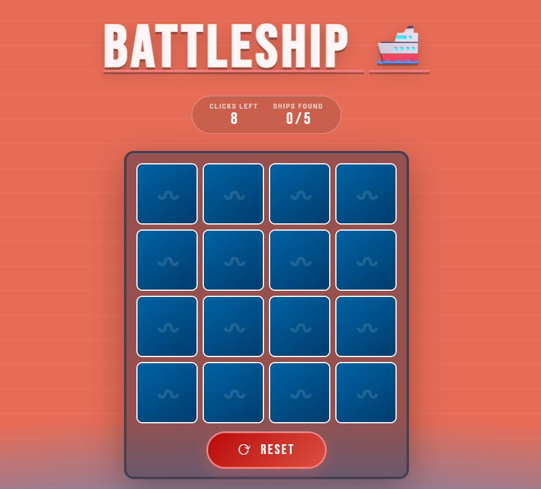
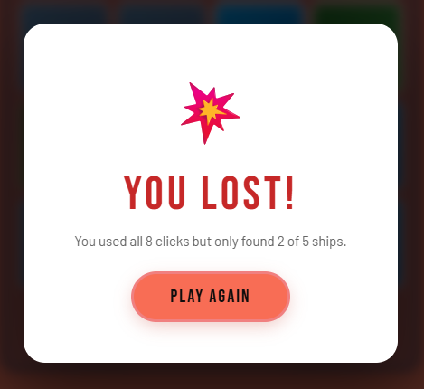
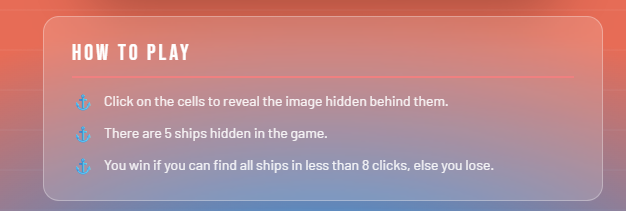

# Battleship Game

A lightweight browser-based Battleship mini-game built with HTML, CSS, and JavaScript.

## Game Overview

This project is a fast, arcade-style version of Battleship played on a 4x4 grid.
You uncover tiles one by one to find all hidden ships before you run out of clicks.

- Grid size: 4x4 (16 cells)
- Hidden ships: 5
- Maximum clicks: 8
- Win condition: find all 5 ships within 8 clicks
- Lose condition: 8 clicks used and not all ships are found

## Features

- Random ship placement every new game
- Animated reveal effect for each clicked cell
- Live status display for:
  - Clicks left
  - Ships found
- Win/Lose result overlay
- One-click reset and play again flow

## Rules And Guidelines

1. Click any unrevealed grid cell to scan it.
2. Each click reveals either:
   - A ship (hit)
   - Water (miss)
3. You can click each cell only once.
4. You have a maximum of 8 clicks.
5. You win immediately when all 5 ships are found.
6. If you reach 8 clicks without finding all ships, you lose.
7. On loss, all remaining hidden cells are revealed.

## How To Play

1. Open the game in your browser.
2. Watch the top status bar:
   - Clicks Left: remaining attempts
   - Ships Found: current progress out of 5
3. Start clicking tiles and try to locate ships efficiently.
4. Use the Reset button anytime to start a fresh round.
5. After win/loss, click Play Again to restart.

## Project Structure

- index.html: Page structure and game UI elements
- styles.css: Game styling, effects, layout, and overlay visuals
- script.js: Core game logic, state management, click handling, and win/loss checks

## Screenshots


### Game Start



### Win Screen

Sadly,i never won.
But you may try your luck.

### Lose Screen



### Instruction Screen



## Setup On Desktop

### Option 1: Clone from GitHub

1. Install Git from https://git-scm.com/downloads
2. Open terminal (PowerShell / Command Prompt)
3. Run:

```bash
git clone https://github.com/Tanmay007-okay/BattleShipGame.git
cd BattleShipGame
```

4. Open project in VS Code (optional):

```bash
code .
```

5. Run the game:
   - Double-click index.html, or
   - Right-click index.html and open in a browser

### Option 2: Download ZIP

1. Open the repository page on GitHub.
2. Click Code -> Download ZIP.
3. Extract ZIP to your Desktop.
4. Open the extracted folder.
5. Open index.html in your browser.

## Development Notes

- No build tools or package installation required.
- Fully frontend and static.
- Works in modern browsers (Chrome, Edge, Firefox).

## Future Improvements (Optional)

- Difficulty levels (different grid sizes)
- Sound effects for hit/miss and game result
- Timer and score system
- Local best-score tracking
- Responsive adjustments for very small screens

## Author

Created by Tanmay.
